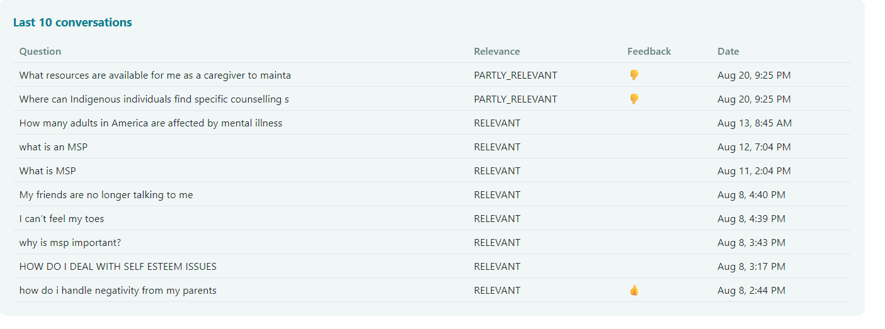

# Mental Health FAQ Assistant

**🔗 Live Demo: [mentalhealthfaq](https://mentalhealthfaq.onrender.com/)**

> **Note:** hosted on Render's free tier, which sleeps after inactivity.
> First request after a while may take 30–60 seconds to wake up : this
> is expected, not a bug.

A Retrieval-Augmented Generation (RAG) chatbot that answers mental health questions grounded in a curated FAQ knowledge base. Built as a practical demonstration of an LLM-powered Q&A feature: retrieval, prompt engineering, generation, and a full evaluation framework covering both retrieval quality and generated-answer relevance.

# Problem Description

People looking for information on mental health conditions, treatment options, and how to access care often face a wall of scattered, inconsistent information. This project builds a focused Q&A assistant that answers strictly from a single, curated FAQ source, so users get concise, grounded answers.


## Target Audience

Adults and adolscents seeking accessible, plain-language information about mental
health; for themselves or someone they care about; covering diagnosis and
symptoms, treatment and therapy options, medication, how to find and pay for
care, and how to support a friend or family member.

## Technologies and Tools Used

- **Flask** :backend web framework serving both the chat UI and the API
  (`/question`, `/feedback`)
- **minsearch** : lightweight TF-IDF + cosine similarity search, used for
  retrieval given the corpus's small size (98 rows)
- **OpenAI `gpt-4o-mini`**: both for answer generation and for LLM-as-judge
  relevance evaluation
- **SQLite** (`sqlite3`, Python standard library): stores every
  conversation (question, answer, retrieved-context-derived response,
  relevance judgment, token usage, cost, response time) and user feedback.
- **pandas / scikit-learn**: data loading and the TF-IDF retrieval backend
- **python-dotenv**: environment variable / API key management
- **uv**:  Python package and virtual environment management

## Dataset

[Mental Health FAQ for Chatbot](https://www.kaggle.com/datasets/narendrageek/mental-health-faq-for-chatbot)
(Kaggle) : 98 question/answer pairs (`Question_ID`, `Questions`, `Answers`),
covering understanding mental illness and specific conditions, treatment and
therapy, medication, finding and accessing care, cost/insurance navigation,
and supporting a friend or family member.

**Note on scope:** several entries reference British Columbia, Canada
specific services and programs (MSP, PharmaCare, BC-based associations). In
a real deployment beyond this proof of concept, this content would be
swapped for region-appropriate resources for the actual target population.

## Architecture

```
User question
     │
     ▼
Flask /question route
     │
     ▼
minsearch retrieval (top-1 closest FAQ match, by cosine similarity)
     │
     ▼
Prompt construction (question + retrieved Q&A context)
     │
     ▼
gpt-4o-mini generates answer
     │
     ▼
gpt-4o-mini (LLM-as-judge) scores answer relevance
     │
     ▼
Answer + relevance + token usage + cost logged to SQLite
     │
     ▼
Answer returned to the chat UI, with 👍/👎 feedback captured on demand
```

## Backend Files Overview

### `config.py`
Source of truth for file paths (`DATA_PATH`, `DB_PATH`).

### `ingest.py`
Loads the FAQ CSV and builds a `minsearch.Index` over the `Questions` and
`Answers` text fields, keyed by `Question_ID`.

### `minsearch.py`
A minimal TF-IDF + cosine similarity search index (text fields vectorized
independently, optional keyword filtering, boosting support). Chosen over a
dense-embedding vector store given the corpus's small size (98 rows), where
TF-IDF's simplicity and zero heavy dependencies outweighed the semantic
retrieval benefits a larger, more paraphrase-heavy corpus would need.

### `rag.py`
Core RAG logic:
- `search(query)`: retrieves the single closest-matching FAQ entry
  (`num_results=1`), to keep the LLM grounded in one concrete answer rather
  than blending several
- `build_prompt(query, search_results)` : constructs the system + user
  prompt from the retrieved Q&A pair
- `llm(prompt, model)` : calls OpenAI, returns both the answer text and
  token usage
- `evaluate_results(question, answer)` : LLM-as-judge relevance scoring
  (`RELEVANT` / `PARTLY_RELEVANT` / `NON_RELEVANT`, with an explanation)
- `calculate_openai_cost(model, tokens)` : per-call cost estimate from token
  usage
- `rag(query, model)` : orchestrates the full flow end to end and returns
  everything `db.py` needs to log

### `db.py`
SQLite conversation and feedback logging : `init_db()`, `save_conversation()`,
`save_feedback()`, `get_recent_conversations()`, `get_feedback_stats()`.


### `db_prep.py`
Run once to (re)initialize the database schema before starting the app.

### `app.py`
Flask application:
- `GET /`: serves the chat UI
- `POST /question`: runs the full RAG pipeline for a user's question, logs
  the conversation, returns the answer
- `POST /feedback`: logs a 👍/👎 for a given conversation

### `templates/index.html`
A lightweight chat interface with inline feedback buttons on every assistant response.

### `templates/dashboard.html`
The monitoring dashboard, built with Chart.js loaded from a CDN, no new
Python dependency. Shows total conversations, feedback counts, relevance
distribution, model usage, and cost, token, and response time trends over
time, plus a table of the five most recent conversations.

## Running the Application

```bash
uv sync
```

Create a `.env` file with:
```
OPENAI_API_KEY=your_key_here
```

Initialize the database:
```bash
uv run python db_prep.py
```

Start the app:
```bash
uv run python app.py
```

## Evaluation

Two separate evaluation approaches, covering both halves of the RAG
pipeline : retrieval and generation : as distinct concerns.

### 1. Retrieval Evaluation

A ground-truth query set was evaluated against the `minsearch` index using
`hit_rate`, `mean reciprocal rank (MRR)`, `precision`, and `recall`, testing
two variables: field-level boosting (`Questions` vs. `Answers` weighting)
and retrieval depth (`num_results`).

| Configuration | Hit Rate | MRR | Precision | Recall |
|---|---|---|---|---|
| Baseline (equal weights, k=5) | 67.75% | 49.35% | 13.55% | 67.75% |
| No boosting, k=10 | 77.14% | 50.58% | 7.71% | 77.14% |
| Tuned boosting (`Questions`: 0.24, `Answers`: 0.88), k=10 | 77.14% | 50.58% | 7.71% | 77.14% |

Key finding: tuned boost weights and no boosting at all produced identical results at the same k — field-level weighting between Questions and Answers had no measurable effect on retrieval quality for this corpus. The entire improvement came from increasing retrieval depth (num_results) from 5 to 10, not from weighting.

- Precision decreases as `k` increases by mathematical necessity, not
  declining quality : with one relevant document per query, precision is
  capped at `1/k` regardless of retrieval quality.

- Hit Rate and Recall remain mathematically identical throughout, since
  each query has exactly one relevant document : both answer the same
  yes/no question from different angles.

- MRR (~0.49–0.51 across configurations, implying the correct document
  typically ranks around position 2) traces to near-duplicate FAQ entries
  in the corpus : nearly identical phrasing under different IDs (e.g. two
  separate entries both asking "how can I find a mental health professional
  for myself or my child," worded slightly differently) : a real corpus
  characteristic, not purely a retrieval defect.


### 2. RAG Flow Evaluation (LLM-as-Judge)

Every generated answer in the evaluation set was scored by an LLM acting as
judge, classifying each as `RELEVANT`, `PARTLY_RELEVANT`, or `NON_RELEVANT`,
with a written explanation for each judgment.

A second run compared `gpt-4o` against `gpt-4o-mini` as the generation
model, with the same model also judging its own answers in each run. Both
runs cover the same 490 ground-truth questions.

| Relevance | gpt-4o-mini | % | gpt-4o | % |
|---|---|---|---|---|
| RELEVANT | 384 | 78.37% | 377 | 76.94% |
| NON_RELEVANT | 53 | 10.82% | 62 | 12.65% |
| PARTLY_RELEVANT | 53 | 10.82% | 51 | 10.41% |


`gpt-4o-mini` performed marginally better on this corpus, both in relevance
rate and cost, since it is also the cheaper model per token. This is a
useful, if modest, finding: a larger model did not produce better grounded
answers here and reinforces `gpt-4o-mini` as the right choice for
this project on both quality and cost grounds, not cost alone.


## Monitoring

Every conversation and feedback event is logged to SQLite (`conversations.db`),
including relevance judgment, token usage, cost, and response time per
interaction.

A lightweight monitoring dashboard is available at `/dashboard`, built
directly into the Flask app with Chart.js, no separate service or new
infrastructure required. It shows total conversations, thumbs up and down
counts, the relevance distribution, model usage, and response time, token
usage, and cost over time, plus a table of the five most recent
conversations. The dashboard queries the same SQLite database directly
through a small set of aggregation functions in `db.py`.

**Note**: Sometimes users migt not provide feedback. 




## Limitations and What's Next

- **Field-level boosting tested, found ineffective: retrieval depth matters
  more** : a random-search parameter tuning experiment (see Evaluation)
  found that weighting `Questions` vs. `Answers` differently had no
  measurable effect on retrieval quality for this corpus: increasing
  `num_results` did. 

- **The live app uses `num_results=1`: deeper retrieval (`k=10`) only
  helped the evaluation's hit_rate/MRR, not the live pipeline** : the
  top-ranked (#1) result is identical regardless of how many results are
  requested, since `num_results` only controls how many candidates are
  *returned*, not how they're *ranked*. The `k=10` improvement specifically
  captured cases where the correct document ranked outside the top 5 but
  within the top 10 : cases the live app's single-best-match retrieval
  wouldn't have found correctly either way. Using more than one retrieved
  context in generation (top-2 or top-3, rather than top-1) is the only way
  this finding would become actionable for live answers, worth
  testing deliberately rather than assuming it's a free improvement.

- **Corpus is regionally specific** (British Columbia, Canada) : a real
  deployment would need region-appropriate content for its actual audience.

- **TF-IDF retrieval (minsearch), not semantic embeddings** : a deliberate
  trade-off given the small corpus size: a larger, more paraphrase-heavy
  corpus would likely benefit from dense embedding retrieval instead.

- **SQLite has no persistent disk on Render's free tier.** The dashboard
  and logging work correctly, but any new deploy rebuilds the container and
  can reset the database. Confirmed directly during development: real
  conversation data logged over several days was lost after a routine code
  push. A production deployment would need either a paid Render plan with
  a persistent disk, or a properly hosted database like Render's own
  Postgres offering.

- **Generation models compared (`gpt-4o` vs. `gpt-4o-mini`): judge model
  still not independently validated** : the comparison above tests
  generation quality across two models, but each run still uses the same
  model to both generate and judge its own answers. Whether the judge
  itself is reliable, independent of which model generated the answer, is
  still untested. A true validation would hold generation constant and
  swap only the judge, or bring in a third model purely as an independent
  judge.

-
