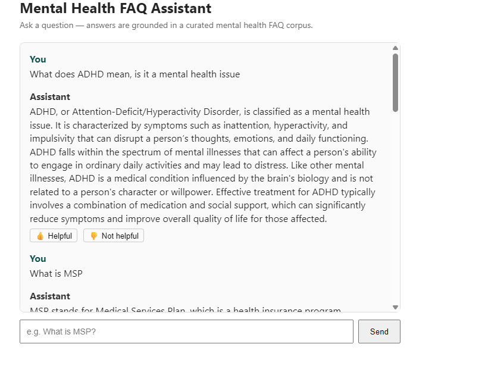
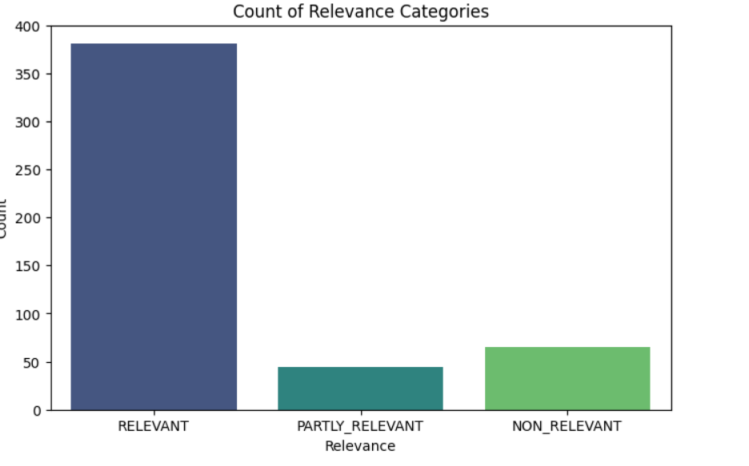

# Mental Health FAQ Assistant

**Live Demo**: https://mentalhealthfaq.onrender.com

> **Note:** hosted on Render's free tier, which sleeps after inactivity.
> First request after a while may take 30–60 seconds to wake up, this
> is expected, not a bug.

A Retrieval-Augmented Generation (RAG) chatbot that answers mental health questions grounded in a curated FAQ knowledge base. Built as a practical demonstration of an LLM-powered Q&A feature: retrieval, prompt engineering, generation, and a full evaluation framework covering both retrieval quality and generated-answer relevance.

# Problem Description

People looking for information on mental health conditions, treatment options, and how to access care often face a wall of scattered, inconsistent information. This project builds a focused Q&A assistant that answers strictly from a single, curated FAQ source, so users get concise, grounded answers.




## Target Audience

Adults and adolscents seeking accessible, plain-language information about mental
health; for themselves or someone they care about; covering diagnosis and
symptoms, treatment and therapy options, medication, how to find and pay for
care, and how to support a friend or family member.

## Technologies and Tools Used

- **Flask** :backend web framework serving both the chat UI and the API
  (`/question`, `/feedback`)
- **minsearch** : lightweight TF-IDF + cosine similarity search, used for
  retrieval given the corpus's small size (98 rows)
- **OpenAI `gpt-4o-mini`**: both for answer generation and for LLM-as-judge
  relevance evaluation
- **SQLite** (`sqlite3`, Python standard library): stores every
  conversation (question, answer, retrieved-context-derived response,
  relevance judgment, token usage, cost, response time) and user feedback.
- **pandas / scikit-learn**: data loading and the TF-IDF retrieval backend
- **python-dotenv**: environment variable / API key management
- **uv**:  Python package and virtual environment management

## Dataset

[Mental Health FAQ for Chatbot](https://www.kaggle.com/datasets/narendrageek/mental-health-faq-for-chatbot)
(Kaggle) which contains 98 question/answer pairs (`Question_ID`, `Questions`, `Answers`),
covering understanding mental illness and specific conditions, treatment and
therapy, medication, finding and accessing care, cost/insurance navigation,
and supporting a friend or family member.

**Note on scope:** several entries reference British Columbia, Canada
specific services and programs (MSP, PharmaCare, BC-based associations). In
a real deployment beyond this proof of concept, this content would be
swapped for region-appropriate resources for the actual target population.

## Architecture

```
User question
     │
     ▼
Flask /question route
     │
     ▼
minsearch retrieval (top-1 closest FAQ match, by cosine similarity)
     │
     ▼
Prompt construction (question + retrieved Q&A context)
     │
     ▼
gpt-4o-mini generates answer
     │
     ▼
gpt-4o-mini (LLM-as-judge) scores answer relevance
     │
     ▼
Answer + relevance + token usage + cost logged to SQLite
     │
     ▼
Answer returned to the chat UI, with 👍/👎 feedback captured on demand
```

## Backend Files Overview

### `config.py`
Source of truth for file paths (`DATA_PATH`, `DB_PATH`).

### `ingest.py`
Loads the FAQ CSV and builds a `minsearch.Index` over the `Questions` and
`Answers` text fields, keyed by `Question_ID`.

### `minsearch.py`
A minimal TF-IDF + cosine similarity search index (text fields vectorized
independently, optional keyword filtering, boosting support). Chosen over a
dense-embedding vector store given the corpus's small size (98 rows), where
TF-IDF's simplicity and zero heavy dependencies outweighed the semantic
retrieval benefits a larger, more paraphrase-heavy corpus would need.

### `rag.py`
Core RAG logic:
- `search(query)`: retrieves the single closest-matching FAQ entry
  (`num_results=1`), to keep the LLM grounded in one concrete answer rather
  than blending several
- `build_prompt(query, search_results)` : constructs the system + user
  prompt from the retrieved Q&A pair
- `llm(prompt, model)` : calls OpenAI, returns both the answer text and
  token usage
- `evaluate_results(question, answer)` : LLM-as-judge relevance scoring
  (`RELEVANT` / `PARTLY_RELEVANT` / `NON_RELEVANT`, with an explanation)
- `calculate_openai_cost(model, tokens)` : per-call cost estimate from token
  usage
- `rag(query, model)` : orchestrates the full flow end to end and returns
  everything `db.py` needs to log

### `db.py`
SQLite conversation and feedback logging : `init_db()`, `save_conversation()`,
`save_feedback()`, `get_recent_conversations()`, `get_feedback_stats()`.


### `db_prep.py`
Run once to (re)initialize the database schema before starting the app.

### `app.py`
Flask application:
- `GET /`: serves the chat UI
- `POST /question`: runs the full RAG pipeline for a user's question, logs
  the conversation, returns the answer
- `POST /feedback`: logs a 👍/👎 for a given conversation

### `templates/index.html`
A lightweight chat interface with inline feedback buttons on every assistant response.

## Running the Application

```bash
uv sync
```

Create a `.env` file with:
```
OPENAI_API_KEY=your_key_here
```

Initialize the database:
```bash
uv run python db_prep.py
```

Start the app:
```bash
uv run python app.py
```

## Evaluation

Two separate evaluation approaches, covering both halves of the RAG
pipeline — retrieval and generation — as distinct concerns.

### 1. Retrieval Evaluation

A ground-truth query set was evaluated against the `minsearch` index using
`hit_rate`, `mean reciprocal rank (MRR)`, `precision`, and `recall`:

- Basic Version: Minsearch Without Boosting

Configuration | Hit Rate | MRR | Precision | Recall
|-----|------|--------|------| ------
| Baseline (equal weights, k= 5) | 67.75% |  49.35% | 13.55% | 67.75%
| No boosting, k=10 |77.14%	| 50.58%| 7.71%	 | 77.14%
| Tuned boosting (Questions: 0.24, Answers: 0.88), k=10	| 77.14% | 50.58% | 7.71% | 77.14%

Key finding: tuned boost weights and no boosting at all produced identical results at the same k — field-level weighting between Questions and Answers had no measurable effect on retrieval quality for this corpus. The entire improvement came from increasing retrieval depth (num_results) from 5 to 10, not from weighting.


**Notes on interpretation:**
- Hit Rate and Recall are mathematically identical here, since each query
  has exactly one relevant document; both answer the same yes/no question
  ("was the correct document retrieved at all") from different angles.

- Precision decreases as k increases by mathematical necessity, 
  not declining quality;  with one relevant document per query, 
  precision is capped at 1/k regardless of retrieval quality.

- MRR (~0.49-0.51, implying the correct document typically ranks around position
  2 rather than 1) was investigated further: the corpus contains
  near-duplicate FAQ entries with nearly identical phrasing but different
  IDs (e.g. two separate entries both asking "how can I find a mental
  health professional for myself or my child," worded slightly differently).
  This means the *content* retrieved is often correct even when the
  *specific expected ID* isn't ranked first.

### 2. RAG Flow Evaluation (LLM-as-Judge)

Every generated answer in the evaluation set was scored by `gpt-4o-mini`
acting as judge, classifying each as `RELEVANT`, `PARTLY_RELEVANT`, or
`NON_RELEVANT`, with a written explanation for each judgment.

| Relevance | Count | % |
|---|---|---|
| RELEVANT | *381* | *77.76%* |
| PARTLY_RELEVANT | *44* | *8.98%* |
| NON_RELEVANT | *65* | *13.27* |




See `rag-test.py` for pulled examples of specific
`NON_RELEVANT`/`PARTLY_RELEVANT` cases and the judge's reasoning for each —
concrete examples of where the system underperformed.

## Monitoring

Every conversation and feedback event is logged to SQLite (`conversations.db`),
including relevance judgment, token usage, cost, and response time per
interaction — sufficient for this PoC to review real usage after the fact.


## Limitations and What's Next

- **Corpus is regionally specific** (British Columbia, Canada): a real
  deployment would need region-appropriate content for its actual audience.
- **TF-IDF retrieval (minsearch), not semantic embeddings**: a deliberate
  trade-off given the small corpus size; a larger, more paraphrase-heavy
  corpus would likely benefit from dense embedding retrieval instead.
- **No live monitoring dashboard**: conversation/feedback data is logged
  but not yet visualized; a Grafana or similar dashboard over the SQLite
  data would be a natural next step.
- **Single LLM evaluated** (`gpt-4o-mini`) for both generation and judging:
  comparing against an alternative model would help validate whether
  relevance judgments are consistent across judges.
- **No automated test suite**:  manual and notebook-based testing was used
  throughout; a `pytest` suite would strengthen this for anything beyond a
  PoC.

